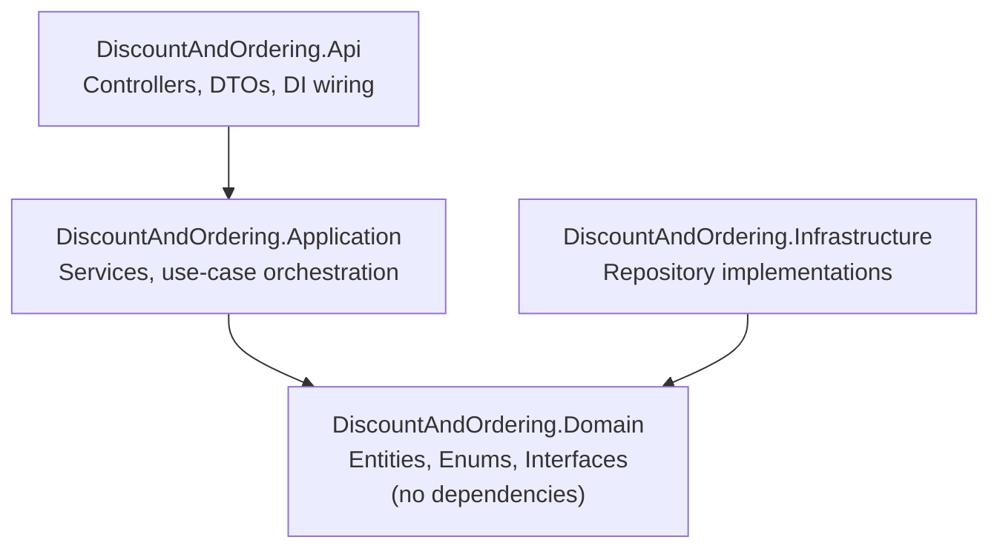

# Architecture Document — Discount & Ordering API

Companion to [SPEC.md](./SPEC.md). This document describes the technical
design: layering, design patterns, and how the SOLID principles are applied
so the system stays extensible.

## 1. Layering (Clean / Onion-style)



Dependency direction: `Api` -> `Application` -> `Domain` <- `Infrastructure`.
`Domain` has no outward dependencies — it defines interfaces that
`Infrastructure` implements and `Application` consumes. This is the
Dependency Inversion Principle applied at the project-reference level, not
just the class level.

## 2. Project Structure

```
src/
  DiscountAndOrdering.Domain/
    Entities/
      User.cs
      Product.cs
      Order.cs
      OrderLineItem.cs
    Enums/
      UserTier.cs
    Interfaces/
      IDiscountStrategy.cs
      IProductRepository.cs
      IOrderRepository.cs
      IUserRepository.cs

  DiscountAndOrdering.Application/
    Discounts/
      PercentageDiscountStrategy.cs
      DiscountSettings.cs
      IDiscountStrategyResolver.cs
      ConfigurableDiscountStrategyResolver.cs
    Services/
      ProductService.cs
      OrderService.cs
      PricingService.cs
    Dtos/
      ProductDto.cs
      CheckoutRequest.cs
      OrderResultDto.cs

  DiscountAndOrdering.Infrastructure/
    Repositories/
      InMemoryProductRepository.cs
      InMemoryOrderRepository.cs
      InMemoryUserRepository.cs

  DiscountAndOrdering.Api/
    Controllers/
      ProductsController.cs
      OrdersController.cs
      UsersController.cs
    Program.cs

tests/
  DiscountAndOrdering.UnitTests/
    Discounts/
    Services/
```

## 3. Design Patterns

### 3.1 Strategy — discount *mechanism* (not one class per tier)

The three v1 tiers (Normal/Premium/SuperPremium) all use the *same*
algorithm — a percentage off the subtotal. The only thing that differs
between them is a number. Modeling that as three near-identical classes
(`PremiumDiscountStrategy`, `SuperPremiumDiscountStrategy`, ...) would mean
every future tier addition and every percentage tweak both require a code
change and a redeploy — which is exactly what NFR-5 rules out.

Instead, `IDiscountStrategy` represents a discount **mechanism**, and a
single `PercentageDiscountStrategy` implementation covers all
percentage-off tiers, parameterized by a value that comes from
configuration:

```csharp
public interface IDiscountStrategy
{
    decimal ApplyDiscount(decimal subtotal);
}

public sealed class PercentageDiscountStrategy : IDiscountStrategy
{
    private readonly decimal _percentage; // 0-100

    public PercentageDiscountStrategy(decimal percentage) => _percentage = percentage;

    public decimal ApplyDiscount(decimal subtotal) => subtotal * (_percentage / 100m);
}
```

A genuinely different discount *mechanism* — flat amount off, buy-one-get-one,
threshold-based — gets its own `IDiscountStrategy` implementation
(`FlatAmountDiscountStrategy`, `BogoDiscountStrategy`, ...). That is the
Strategy pattern's actual job here: swapping *algorithms*, not carrying
per-tier magic numbers.

### 3.2 Tier → strategy resolution, driven by configuration

```csharp
public sealed class DiscountSettings
{
    // key = UserTier name, value = percentage (0-100)
    public Dictionary<string, decimal> TierPercentages { get; set; } = new();
}

public interface IDiscountStrategyResolver
{
    IDiscountStrategy Resolve(UserTier tier);
}

public sealed class ConfigurableDiscountStrategyResolver : IDiscountStrategyResolver
{
    private readonly DiscountSettings _settings;

    public ConfigurableDiscountStrategyResolver(IOptionsSnapshot<DiscountSettings> options)
        => _settings = options.Value;

    public IDiscountStrategy Resolve(UserTier tier)
    {
        if (!_settings.TierPercentages.TryGetValue(tier.ToString(), out var percentage))
            throw new InvalidOperationException($"No discount configuration for tier '{tier}'.");

        return new PercentageDiscountStrategy(percentage);
    }
}
```

`appsettings.json`:
```json
{
  "DiscountSettings": {
    "TierPercentages": { "Normal": 0, "Premium": 20, "SuperPremium": 30 }
  }
}
```

`Program.cs`:
```csharp
builder.Services.Configure<DiscountSettings>(builder.Configuration.GetSection("DiscountSettings"));
builder.Services.AddScoped<IDiscountStrategyResolver, ConfigurableDiscountStrategyResolver>();
```

`PricingService` depends only on `IDiscountStrategyResolver` — never on a
concrete strategy or a `switch` on `UserTier`.

**What each kind of change costs, concretely:**
| Change | Cost |
|---|---|
| Tweak Premium from 20% to 25% | Edit `appsettings.json`. No code, no rebuild (via `IOptionsSnapshot`/`IOptionsMonitor`). |
| Add a new percentage-off tier (e.g. "Gold") | Add a `UserTier` enum member + one config entry. No new class, no service change. |
| Add a new discount *mechanism* (flat $, BOGO) | Add one new `IDiscountStrategy` implementation + one branch in the resolver's construction logic. Nothing else changes. |

**Decision**: `UserTier` stays a compile-time C# enum — runtime/admin-created
tiers are explicitly out of scope. Adding a brand-new tier therefore still
needs a small rebuild/redeploy (an enum member + a config entry), but never
touches `OrderService`, `PricingService`, controllers, or any discount
class. Discount *percentages*, which change far more often than the tier
list itself, are fully configuration-driven with no rebuild required.

### 3.3 Repository — persistence abstraction

```csharp
public interface IProductRepository
{
    Task<Product?> GetByIdAsync(Guid id);
    Task<IReadOnlyList<Product>> GetAllAsync();
    Task AddAsync(Product product);
    Task UpdateAsync(Product product);
    Task DeleteAsync(Guid id);
}
```

`Application` depends only on this interface. `Infrastructure` provides
`InMemoryProductRepository` today; a future `EfCoreProductRepository` can
be substituted with a one-line DI registration change and nothing else in
the codebase moves. Interfaces stay narrow and role-specific (one per
aggregate: Product, Order, User) rather than one large repository
interface — Interface Segregation Principle.

### 3.4 Service layer — orchestration, single responsibility

- `ProductService` — catalog CRUD, delegates to `IProductRepository`.
- `PricingService` — takes cart line items + user tier, computes subtotal, resolves and applies the correct `IDiscountStrategy`, returns final pricing breakdown. Has no persistence knowledge.
- `OrderService` — orchestrates checkout: validates stock via `IProductRepository`, calls `PricingService` for pricing, builds the `Order` aggregate, persists via `IOrderRepository`.

Each service has one axis of responsibility, and all cross-layer
dependencies are on interfaces injected via the built-in ASP.NET Core DI
container (Dependency Inversion Principle).

## 4. Checkout Sequence

1. `OrdersController.Checkout` receives `CheckoutRequest { UserId, Items[] }`.
2. `OrderService`:
   a. Loads the user via `IUserRepository` → gets `UserTier`.
   b. Loads each product via `IProductRepository`, validates stock.
   c. Builds line items (snapshotting product name/price).
   d. Calls `PricingService.CalculatePricing(lineItems, userTier)`.
3. `PricingService`:
   a. Sums line totals → subtotal.
   b. Calls `IDiscountStrategyResolver.Resolve(userTier)` to get the applicable `IDiscountStrategy`.
   c. Computes `discountAmount = strategy.ApplyDiscount(subtotal)`.
   d. Returns `finalTotal = subtotal - discountAmount`.
4. `OrderService` persists the completed `Order` via `IOrderRepository`.
5. Controller maps the result to `OrderResultDto` and returns `201 Created`.

## 5. SOLID Summary

| Principle | How it's applied |
|---|---|
| **S**ingle Responsibility | Each discount strategy, repository, and service has exactly one reason to change. `PercentageDiscountStrategy` computes; `ConfigurableDiscountStrategyResolver` decides which strategy/value applies. |
| **O**pen/Closed | New discount *mechanisms* extend the system via new `IDiscountStrategy` implementations; new percentage-off *tiers* extend it via configuration alone — neither touches existing classes. |
| **L**iskov Substitution | Any `IDiscountStrategy` implementation is fully interchangeable behind the interface; `PricingService` never inspects which one it got. |
| **I**nterface Segregation | Narrow, role-specific interfaces (`IProductRepository`, `IOrderRepository`, `IUserRepository`, `IDiscountStrategy`, `IDiscountStrategyResolver`) instead of one broad abstraction. |
| **D**ependency Inversion | `Application` and `Api` depend only on `Domain`/`Application` interfaces; `Infrastructure` implementations and configuration values are wired in at composition root (`Program.cs`). |

## 6. Extensibility Points (mapped to SPEC §8, NFR-5)

- **Change a tier's discount percentage**: edit `appsettings.json` — no code change.
- **New percentage-off tier**: add a `UserTier` enum member + one `appsettings.json` entry — no new class.
- **New discount mechanism** (flat amount, BOGO, threshold): add one `IDiscountStrategy` implementation + one branch in the resolver — no other class changes.
- **Discount stacking**: introduce a `CompositeDiscountStrategy` or pipeline of `IDiscountRule` objects (Decorator/Chain-of-Responsibility) consumed by `PricingService` — additive change, no existing strategy classes change.
- **Real database**: implement `EfCore*Repository` classes against the existing repository interfaces; swap DI registrations in `Program.cs`.
- **Auth**: add authentication middleware + replace explicit `userId` parameters with claims-based identity inside controllers; `Application`/`Domain` layers are unaffected.

## 7. Technology Stack (v1)

- ASP.NET Core Web API (.NET 8)
- Built-in DI container with the Options pattern (`IOptionsSnapshot<DiscountSettings>`) for config-driven discount percentages
- In-memory repositories (`ConcurrentDictionary`-backed)
- xUnit for unit tests
