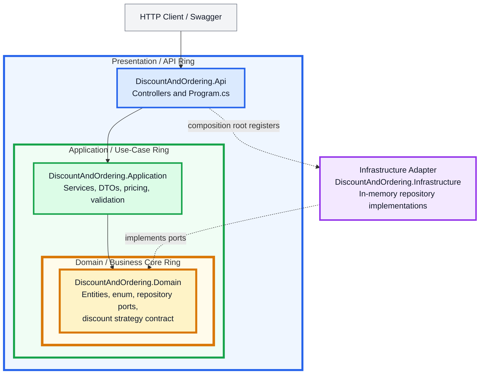
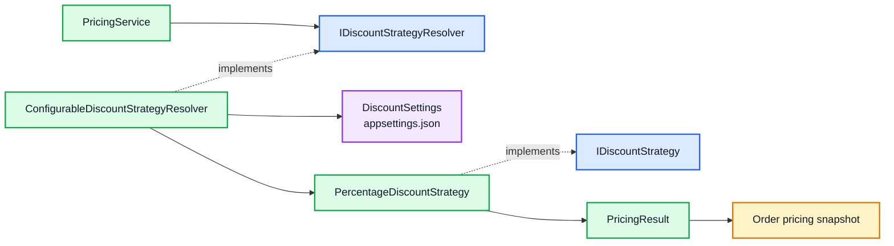
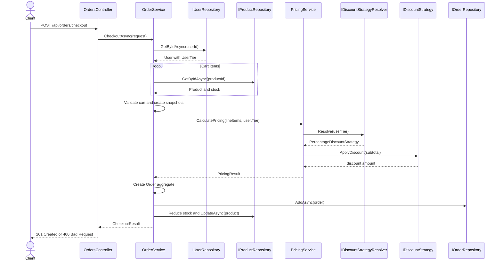

# Onion Architecture and DDD Architecture

This document presents the repository as an Onion Architecture and a DDD-inspired domain model.

## 1. Circular Onion Architecture

The dependency rule is: outer layers depend inward; inner layers do not depend on outer layers.



The project dependency direction is:

```text
DiscountAndOrdering.Api
    -> DiscountAndOrdering.Application
    -> DiscountAndOrdering.Domain

DiscountAndOrdering.Infrastructure
    -> DiscountAndOrdering.Domain
```

The runtime composition is performed by `DiscountAndOrdering.Api/Program.cs`.

---

## 2. Project and namespace placement

```text
src/
  DiscountAndOrdering.Api/
    Controllers/
      ProductsController.cs
      UsersController.cs
      OrdersController.cs
    Program.cs
    appsettings.json

  DiscountAndOrdering.Application/
    Services/
      ProductService.cs
      UserService.cs
      OrderService.cs
      PricingService.cs
    Discounts/
      IDiscountStrategyResolver.cs
      ConfigurableDiscountStrategyResolver.cs
      PercentageDiscountStrategy.cs
      DiscountSettings.cs
    Dtos/
      ProductDto.cs
      UserDto.cs
      CheckoutRequest.cs
      CheckoutResult.cs
      OrderResultDto.cs
    Exceptions/
      ValidationException.cs

  DiscountAndOrdering.Domain/
    Entities/
      User.cs
      Product.cs
      Order.cs
      OrderLineItem.cs
    Enums/
      UserTier.cs
    Interfaces/
      IUserRepository.cs
      IProductRepository.cs
      IOrderRepository.cs
      IDiscountStrategy.cs

  DiscountAndOrdering.Infrastructure/
    Repositories/
      InMemoryUserRepository.cs
      InMemoryProductRepository.cs
      InMemoryOrderRepository.cs

tests/
  DiscountAndOrdering.UnitTests/
```

---

## 3. DDD circular domain model

This diagram shows the **DDD aggregate boundaries**. The repository interfaces are shown as ports outside the aggregates. They are not part of the `Order` aggregate and are not connected directly to unrelated entities.

```mermaid
flowchart TB
    subgraph DDD["DDD Domain Model"]
        subgraph USER_AGG["User Aggregate"]
            USER["User<br/><br/>Id<br/>Name<br/>Email<br/>Tier"]
            TIER["UserTier enum<br/><br/>Normal<br/>Premium<br/>SuperPremium<br/>Platinum"]
            USER --> TIER
        end

        subgraph PRODUCT_AGG["Product Aggregate"]
            PRODUCT["Product<br/><br/>Id<br/>Name<br/>Description<br/>Price<br/>StockQuantity"]
            PRODUCT_RULES["Product behavior<br/><br/>UpdateDetails()<br/>ReduceStock()"]
            PRODUCT --> PRODUCT_RULES
        end

        subgraph ORDER_AGG["Order Aggregate"]
            ORDER["Order<br/><br/>Id<br/>UserId<br/>OrderDate<br/>Subtotal<br/>DiscountPercentage<br/>DiscountAmount<br/>FinalTotal"]
            LINE["OrderLineItem<br/><br/>ProductId<br/>ProductName snapshot<br/>UnitPrice snapshot<br/>Quantity<br/>LineTotal"]
            ORDER *-- LINE
        end
    end

    subgraph PORTS["Domain Ports / Contracts"]
        USER_PORT["IUserRepository"]
        PRODUCT_PORT["IProductRepository"]
        ORDER_PORT["IOrderRepository"]
        DISCOUNT_PORT["IDiscountStrategy"]
    end

    USER_PORT -. persists .-> USER
    PRODUCT_PORT -. persists .-> PRODUCT
    ORDER_PORT -. persists .-> ORDER

    ORDER -. references UserId .-> USER
    LINE -. stores ProductId and snapshots name/price .-> PRODUCT

    classDef aggregate fill:#fff7ed,stroke:#c2410c,stroke-width:3px,color:#111827;
    classDef entity fill:#fffbeb,stroke:#d97706,stroke-width:2px,color:#111827;
    classDef port fill:#eff6ff,stroke:#2563eb,stroke-width:2px,color:#111827;
    classDef policy fill:#f3e8ff,stroke:#9333ea,stroke-width:2px,color:#111827;

    class USER,PRODUCT,ORDER aggregate;
    class TIER,LINE,PRODUCT_RULES entity;
    class USER_PORT,PRODUCT_PORT,ORDER_PORT port;
    class DISCOUNT_PORT policy;

    style DDD fill:#fefce8,stroke:#a16207,stroke-width:4px;
    style USER_AGG fill:#fff7ed,stroke:#ea580c,stroke-width:3px;
    style PRODUCT_AGG fill:#f0fdf4,stroke:#16a34a,stroke-width:3px;
    style ORDER_AGG fill:#eff6ff,stroke:#2563eb,stroke-width:3px;
    style PORTS fill:#f5f3ff,stroke:#7c3aed,stroke-width:3px;
```

### Important relationship corrections

- `User` owns its membership tier state through `UserTier`.
- `Product` owns stock behavior through `ReduceStock(int)`.
- `Order` owns its `OrderLineItem` collection.
- `OrderLineItem` is not an independent aggregate and has no repository.
- `OrderLineItem` references a product by `ProductId` but stores product name and price snapshots.
- `IUserRepository` persists `User`.
- `IProductRepository` persists `Product`.
- `IOrderRepository` persists `Order`.
- `IDiscountStrategy` is a discount-policy contract used by application pricing. It is intentionally **not connected directly to the `Order` entity**, because `Order` does not invoke the strategy itself.

### Aggregate boundaries

| Aggregate | Aggregate root | Owned objects | Important behavior |
|---|---|---|---|
| User | `User` | `UserTier` state | `UpdateDetails()` validates user data |
| Product | `Product` | Product state | `UpdateDetails()` and `ReduceStock()` protect product rules |
| Order | `Order` | `OrderLineItem` collection | Requires at least one line item and stores checkout pricing |

---

## 4. Discount policy relationship

The discount strategy belongs to the application pricing flow. It is separate from the persistence ports and aggregates.



`PricingService` calculates the subtotal, resolves the strategy for the user's tier, applies the discount, and returns the pricing result. `OrderService` then creates the `Order` aggregate using that result.

---

## 5. Complete class and interface connections

```mermaid
flowchart LR
    subgraph API["API Layer"]
        PRODUCTS_CONTROLLER["ProductsController"]
        USERS_CONTROLLER["UsersController"]
        ORDERS_CONTROLLER["OrdersController"]
        PROGRAM["Program.cs"]
    end

    subgraph APPLICATION["Application Layer"]
        PRODUCT_SERVICE["ProductService"]
        USER_SERVICE["UserService"]
        ORDER_SERVICE["OrderService"]
        PRICING_SERVICE["PricingService"]
        RESOLVER["ConfigurableDiscountStrategyResolver"]
        RESOLVER_INTERFACE["IDiscountStrategyResolver"]
        STRATEGY["PercentageDiscountStrategy"]
    end

    subgraph DOMAIN["Domain Layer"]
        USER["User"]
        PRODUCT["Product"]
        ORDER["Order"]
        LINE_ITEM["OrderLineItem"]
        USER_TIER["UserTier"]
        USER_REPOSITORY["IUserRepository"]
        PRODUCT_REPOSITORY["IProductRepository"]
        ORDER_REPOSITORY["IOrderRepository"]
        DISCOUNT_STRATEGY["IDiscountStrategy"]
    end

    subgraph INFRASTRUCTURE["Infrastructure Layer"]
        IN_MEMORY_USER["InMemoryUserRepository"]
        IN_MEMORY_PRODUCT["InMemoryProductRepository"]
        IN_MEMORY_ORDER["InMemoryOrderRepository"]
    end

    PROGRAM --> PRODUCT_SERVICE
    PROGRAM --> USER_SERVICE
    PROGRAM --> ORDER_SERVICE
    PROGRAM --> PRICING_SERVICE
    PROGRAM --> RESOLVER
    PROGRAM -. registers .-> IN_MEMORY_USER
    PROGRAM -. registers .-> IN_MEMORY_PRODUCT
    PROGRAM -. registers .-> IN_MEMORY_ORDER

    PRODUCTS_CONTROLLER --> PRODUCT_SERVICE
    USERS_CONTROLLER --> USER_SERVICE
    USERS_CONTROLLER --> ORDER_SERVICE
    ORDERS_CONTROLLER --> ORDER_SERVICE

    PRODUCT_SERVICE --> PRODUCT_REPOSITORY
    USER_SERVICE --> USER_REPOSITORY
    ORDER_SERVICE --> USER_REPOSITORY
    ORDER_SERVICE --> PRODUCT_REPOSITORY
    ORDER_SERVICE --> ORDER_REPOSITORY
    ORDER_SERVICE --> PRICING_SERVICE

    PRICING_SERVICE --> RESOLVER_INTERFACE
    RESOLVER -. implements .-> RESOLVER_INTERFACE
    RESOLVER --> STRATEGY
    STRATEGY -. implements .-> DISCOUNT_STRATEGY

    USER_REPOSITORY --> USER
    PRODUCT_REPOSITORY --> PRODUCT
    ORDER_REPOSITORY --> ORDER
    USER --> USER_TIER
    ORDER *-- LINE_ITEM
    LINE_ITEM -. snapshots .-> PRODUCT

    IN_MEMORY_USER -. implements .-> USER_REPOSITORY
    IN_MEMORY_PRODUCT -. implements .-> PRODUCT_REPOSITORY
    IN_MEMORY_ORDER -. implements .-> ORDER_REPOSITORY
```

---

## 6. Checkout flow



---

## 7. DDD assessment

The repository is DDD-inspired and uses:

- Entities with behavior and validation
- Aggregate roots
- Child entities owned by an aggregate
- Repository interfaces as domain ports
- Business rules protected inside entities
- Application services for use-case orchestration
- A replaceable discount policy

It does not currently include advanced DDD features such as value objects, domain events, unit of work, separate bounded contexts, CQRS, or event sourcing.

The corrected DDD model therefore treats the repository as three main aggregates—`User`, `Product`, and `Order`—with discount calculation represented as an application-level policy that produces the pricing snapshot stored by `Order`.

## 8. Conclusion

The repository follows this architecture:

```text
API / Presentation
        ↓
Application / Use Cases
        ↓
Domain / Aggregates and Ports
        ↑
Infrastructure / Port Implementations
```

The DDD center is composed of the `User`, `Product`, and `Order` aggregates. `Order` owns `OrderLineItem`, while repositories and discount policies remain correctly separated from the aggregate relationships.
