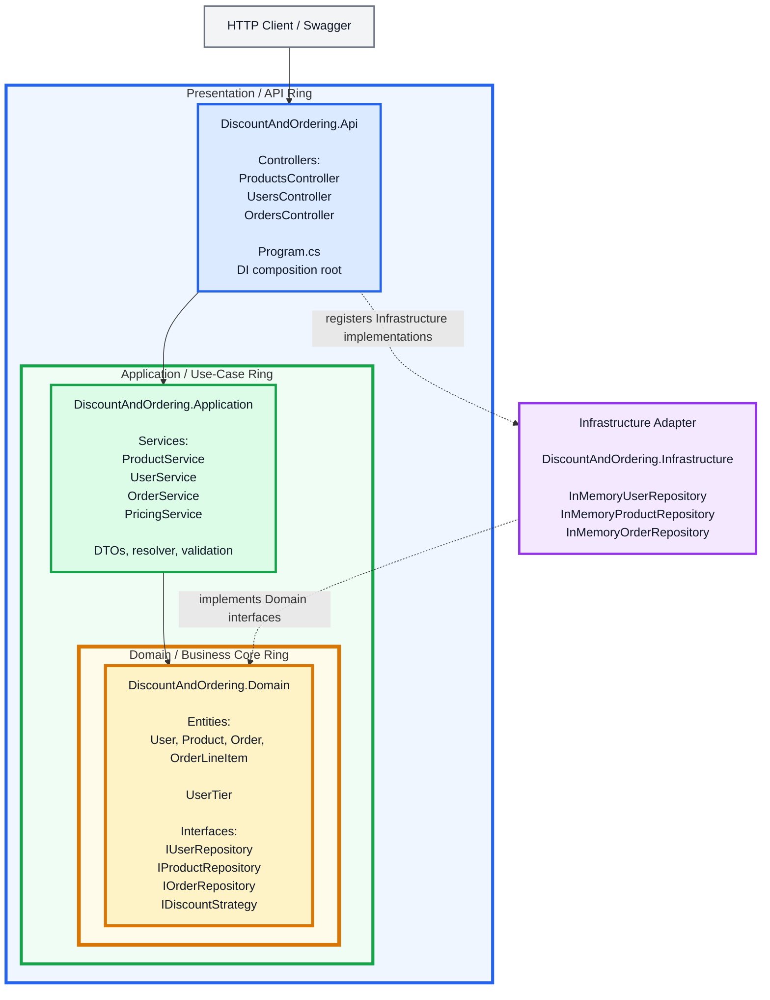
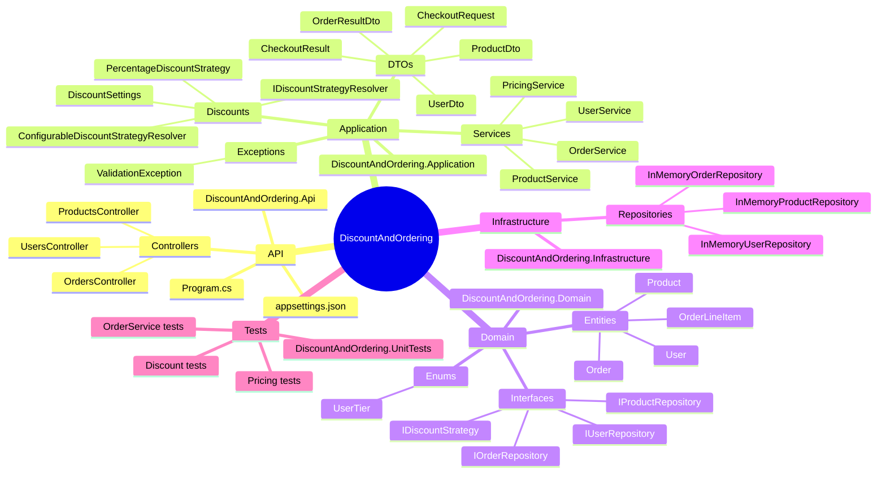
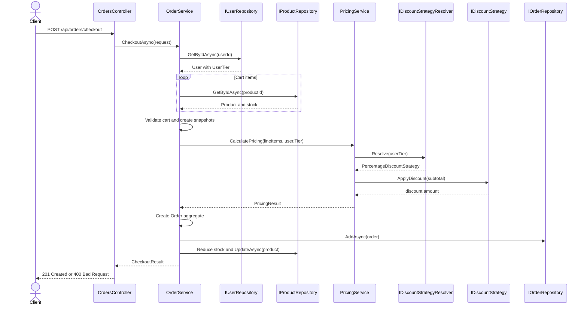

# Onion Architecture and DDD Architecture

This document presents the repository as a **circular Onion Architecture diagram** and a **DDD aggregate/class relationship diagram**.

## 1. Circular Onion Architecture

The dependency rule is: **outer layers depend inward; inner layers never depend on outer layers**.



### Circular layer interpretation

```text
┌─────────────────────────────────────────────────────────────┐
│ API / Presentation                                          │
│  ┌───────────────────────────────────────────────────────┐  │
│  │ Application / Use Cases                              │  │
│  │  ┌───────────────────────────────────────────────┐   │  │
│  │  │ Domain Core                                  │   │  │
│  │  │ User, Product, Order, policies, interfaces   │   │  │
│  │  └───────────────────────────────────────────────┘   │  │
│  └───────────────────────────────────────────────────────┘  │
└─────────────────────────────────────────────────────────────┘

Infrastructure is an external adapter that implements interfaces
owned by the Domain layer.
```

The effective dependency direction is:

```text
HTTP Client
    ↓
DiscountAndOrdering.Api
    ↓
DiscountAndOrdering.Application
    ↓
DiscountAndOrdering.Domain
    ↑
DiscountAndOrdering.Infrastructure
```

`DiscountAndOrdering.Domain` has no project dependency on the outer layers.

---

## 2. Project and namespace placement



---

## 3. DDD circular domain model

```mermaid
flowchart TB
    subgraph DOMAIN_CORE["DDD Domain Core"]
        USER["User Aggregate Root<br/><br/>Id<br/>Name<br/>Email<br/>Tier: UserTier<br/><br/>UpdateDetails()"]
        PRODUCT["Product Aggregate Root<br/><br/>Id<br/>Name<br/>Description<br/>Price<br/>StockQuantity<br/><br/>UpdateDetails()<br/>ReduceStock()"]
        ORDER["Order Aggregate Root<br/><br/>Id<br/>UserId<br/>OrderDate<br/>Subtotal<br/>DiscountPercentage<br/>DiscountAmount<br/>FinalTotal"]
        LINE["OrderLineItem<br/><br/>ProductId<br/>ProductName snapshot<br/>UnitPrice snapshot<br/>Quantity<br/>LineTotal"]
        TIER["UserTier<br/>Normal<br/>Premium<br/>SuperPremium<br/>Platinum"]
    end

    USER --> TIER
    ORDER *-- LINE
    ORDER -. belongs to .-> USER
    LINE -. references and snapshots .-> PRODUCT

    subgraph DOMAIN_PORTS["Domain Ports"]
        UR["IUserRepository"]
        PR["IProductRepository"]
        OR["IOrderRepository"]
        DS["IDiscountStrategy"]
    end

    UR --> USER
    PR --> PRODUCT
    OR --> ORDER
    DS -. discount policy contract .-> ORDER
```

### DDD aggregate boundaries

| Aggregate | Root | Owned objects | Main invariants |
|---|---|---|---|
| User | `User` | `UserTier` value | Name and email are required |
| Product | `Product` | Product state | Price must be positive; stock cannot be negative |
| Order | `Order` | `OrderLineItem` collection | Order must contain at least one item; pricing is captured at checkout |

`OrderLineItem` belongs to the `Order` aggregate and has no independent repository or lifecycle.

---

## 4. Complete class and interface connections

```mermaid
flowchart LR
    subgraph API["API Layer"]
        P["ProductsController"]
        U["UsersController"]
        O["OrdersController"]
        ROOT["Program.cs"]
    end

    subgraph APP["Application Layer"]
        PS["ProductService"]
        US["UserService"]
        OS["OrderService"]
        PRICE["PricingService"]
        RESOLVER["ConfigurableDiscountStrategyResolver"]
        RESOLVER_PORT["IDiscountStrategyResolver"]
        STRATEGY["PercentageDiscountStrategy"]
        SETTINGS["DiscountSettings"]
    end

    subgraph DOMAIN["Domain Layer"]
        USER["User"]
        PRODUCT["Product"]
        ORDER["Order"]
        ITEM["OrderLineItem"]
        TIER["UserTier"]
        IUSER["IUserRepository"]
        IPRODUCT["IProductRepository"]
        IORDER["IOrderRepository"]
        IDISCOUNT["IDiscountStrategy"]
    end

    subgraph INFRA["Infrastructure Layer"]
        IU["InMemoryUserRepository"]
        IP["InMemoryProductRepository"]
        IO["InMemoryOrderRepository"]
    end

    ROOT --> P
    ROOT --> U
    ROOT --> O
    ROOT --> IU
    ROOT --> IP
    ROOT --> IO
    ROOT --> RESOLVER

    P --> PS
    U --> US
    U --> OS
    O --> OS

    PS --> IProduct
    US --> IUSER
    OS --> IUSER
    OS --> IPRODUCT
    OS --> IORDER
    OS --> PRICE

    PRICE --> RESOLVER_PORT
    RESOLVER -. implements .-> RESOLVER_PORT
    RESOLVER --> SETTINGS
    RESOLVER --> STRATEGY
    STRATEGY -. implements .-> IDISCOUNT
    RESOLVER_PORT --> IDISCOUNT

    IUSER --> USER
    IPRODUCT --> PRODUCT
    IORDER --> ORDER
    USER --> TIER
    ORDER *-- ITEM
    ITEM -. product snapshot .-> PRODUCT

    IU -. implements .-> IUSER
    IP -. implements .-> IPRODUCT
    IO -. implements .-> IORDER
```

---

## 5. Checkout use-case flow



---

## 6. Patterns represented by the circular architecture

| Pattern | Main types | Role |
|---|---|---|
| Onion / Clean Architecture | `Api`, `Application`, `Domain`, `Infrastructure` | Controls dependency direction |
| Domain Model | `User`, `Product`, `Order`, `OrderLineItem` | Encapsulates business state and invariants |
| Repository | `IUserRepository`, `IProductRepository`, `IOrderRepository` | Hides persistence details |
| Strategy | `IDiscountStrategy`, `PercentageDiscountStrategy` | Makes discount algorithms replaceable |
| Resolver / Factory | `IDiscountStrategyResolver`, `ConfigurableDiscountStrategyResolver` | Selects the discount strategy |
| Application Service | `OrderService`, `PricingService`, `ProductService`, `UserService` | Orchestrates use cases |
| DTO | `CheckoutRequest`, `OrderResultDto`, `ProductDto`, `UserDto` | Separates API contracts from entities |
| Dependency Injection | `Program.cs` | Composes the application at runtime |

---

## 7. DDD maturity assessment

The repository is **DDD-inspired** and uses several tactical DDD concepts:

- Entities with behavior and validation
- Aggregate roots
- Child entities owned by an aggregate
- Repository interfaces as domain ports
- Business rules protected inside entities
- Application services for use-case orchestration

It does not yet implement every advanced DDD technique, such as:

- Value objects such as `Money` or `Email`
- Domain events
- Unit of Work
- Explicit domain services
- Separate bounded-context projects
- CQRS or event sourcing

For the current discount and ordering API, the lightweight model is practical and appropriate.

---

## 8. Architectural conclusion

The repository follows this circular Onion Architecture:

```text
                 ┌─────────────────────────────┐
                 │ API / Presentation           │
                 │ Controllers, Program.cs     │
                 │                              │
                 │  ┌───────────────────────┐  │
                 │  │ Application            │  │
                 │  │ Services, DTOs,        │  │
                 │  │ pricing orchestration  │  │
                 │  │                       │  │
                 │  │  ┌─────────────────┐  │  │
                 │  │  │ Domain Core     │  │  │
                 │  │  │ Entities,       │  │  │
                 │  │  │ invariants,     │  │  │
                 │  │  │ interfaces      │  │  │
                 │  │  └─────────────────┘  │  │
                 │  └───────────────────────┘  │
                 └─────────────────────────────┘

 Infrastructure sits outside the onion and implements
 interfaces defined by the Domain core.
```

In one sentence:

> The repository uses Onion Architecture for dependency control and a DDD-inspired domain model for users, products, orders, pricing policies, aggregate ownership, and persistence abstraction.
