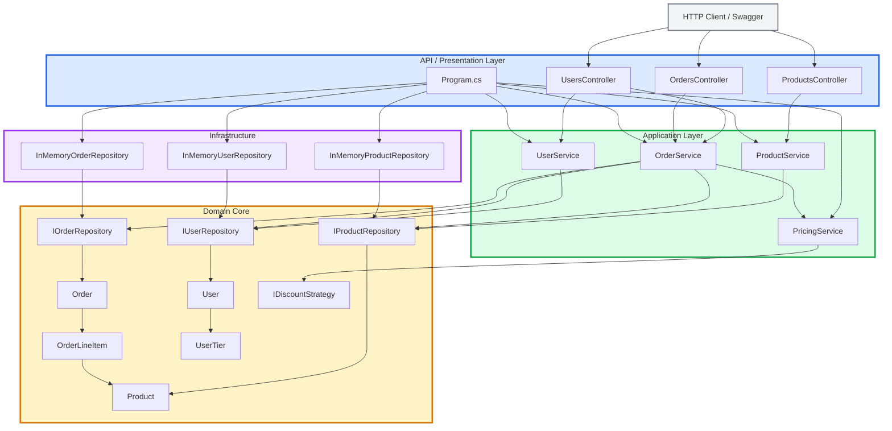
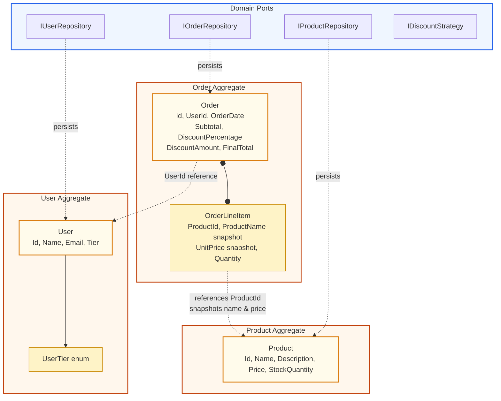
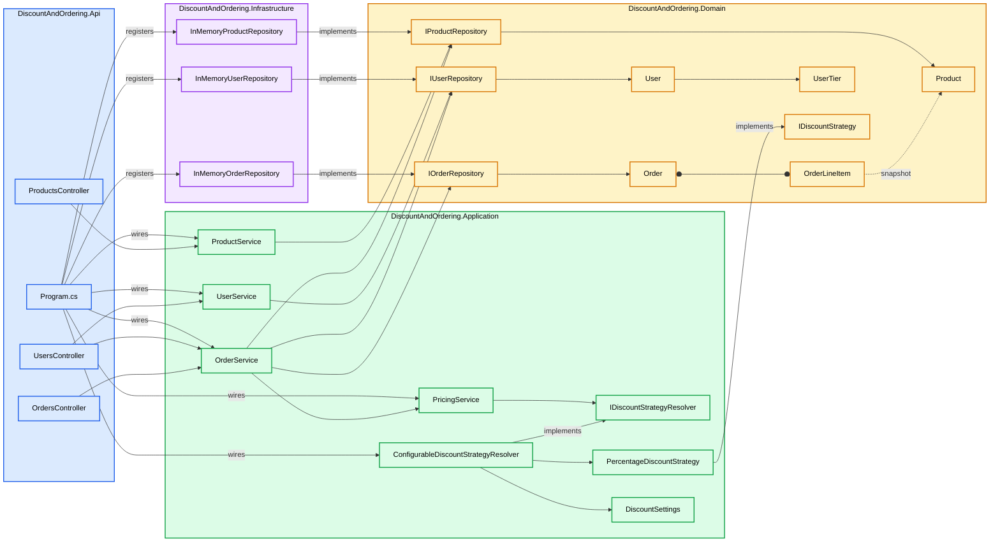
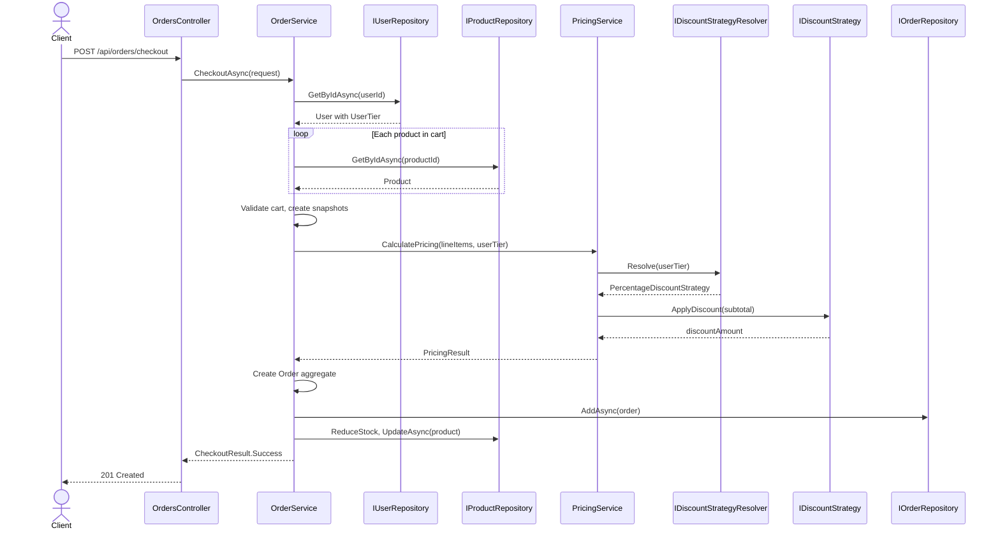
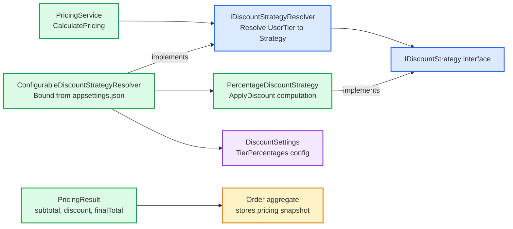

# Onion Architecture and DDD Architecture

This document presents the repository as an Onion Architecture and a DDD-inspired domain model.

## 1. Circular Onion Architecture

The dependency rule is: outer layers depend inward; inner layers do not depend on outer layers.



### Dependency direction

```text
DiscountAndOrdering.Api
    -> DiscountAndOrdering.Application
    -> DiscountAndOrdering.Domain

DiscountAndOrdering.Infrastructure
    -> DiscountAndOrdering.Domain
```

---

## 2. DDD Aggregate Boundaries

Three main aggregates define the domain:

### User Aggregate Root
- **Root**: `User`
- **Includes**: `UserTier`
- **Behavior**: `UpdateDetails()` validates user data
- **Repository**: `IUserRepository`

### Product Aggregate Root
- **Root**: `Product`
- **Behavior**: `UpdateDetails()` validates product data, `ReduceStock(qty)` prevents negative stock
- **Repository**: `IProductRepository`

### Order Aggregate Root
- **Root**: `Order`
- **Owns**: `OrderLineItem` (no independent repository)
- **Behavior**: Requires at least one line item; stores pricing snapshots (product name, unit price)
- **Repository**: `IOrderRepository`

**Important**: `OrderLineItem` references `ProductId` but owns snapshots of product name and price. It does not own the product itself.



---

## 3. Complete Class and Interface Connections



---

## 4. Checkout Sequence



---

## 5. Discount Policy (Separate from Aggregates)

The discount policy is **not part of the Order aggregate**. It belongs to the Application layer pricing orchestration.



---

## 6. Key Architectural Patterns

| Pattern | Implementation | Purpose |
|---|---|---|
| **Onion Architecture** | 4-layer project structure (API, Application, Domain, Infrastructure) | Dependency control: inner layers independent of outer |
| **Domain-Driven Design** | 3 aggregate roots (User, Product, Order) with repository ports | Business logic centralized in entities, persistence abstracted |
| **Strategy Pattern** | `IDiscountStrategy`, `PercentageDiscountStrategy` | Discount algorithms replaceable without service changes |
| **Repository Pattern** | `IUserRepository`, `IProductRepository`, `IOrderRepository` | Persistence details hidden from business logic |
| **Service Layer** | `OrderService`, `PricingService`, `ProductService`, `UserService` | Use-case orchestration separated from HTTP handling |
| **Dependency Injection** | `Program.cs` DI container | Runtime composition without hard-coded dependencies |
| **DTO Pattern** | `CheckoutRequest`, `OrderResultDto`, `ProductDto`, `UserDto` | API contracts separated from domain entities |

---

## 7. DDD Assessment

✅ **What is implemented**:
- Entities with embedded business rules
- Aggregate roots with clear boundaries
- Child entities owned by aggregates (OrderLineItem)
- Repository interfaces as domain ports
- Invariant enforcement (positive prices, non-negative stock)
- Pricing snapshot on Order for historical accuracy

❌ **What is not yet implemented**:
- Value objects (Money, Email, Quantity)
- Domain events
- Unit of Work pattern
- Explicit domain services
- Separate bounded contexts
- CQRS or event sourcing

The current implementation is **pragmatically DDD-inspired** rather than enterprise-grade DDD.

---

## 8. Final Summary

This repository demonstrates:

1. **Onion Architecture** through correct project layering and inward-pointing dependencies
2. **DDD tactical patterns** with aggregates, repositories, entities, and business rules
3. **SOLID principles** across all layers
4. **Separation of concerns** between HTTP handling, orchestration, business logic, and persistence

**Architecture statement**:

> The repository follows Onion Architecture in project structure and DDD-inspired modeling in aggregates and repository ports, while keeping the implementation lightweight and practical for a small-to-medium enterprise C# service.
