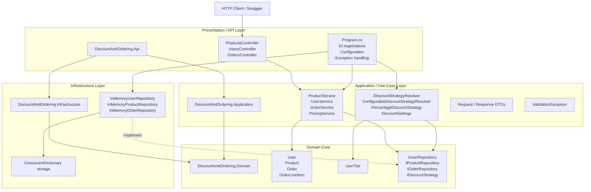
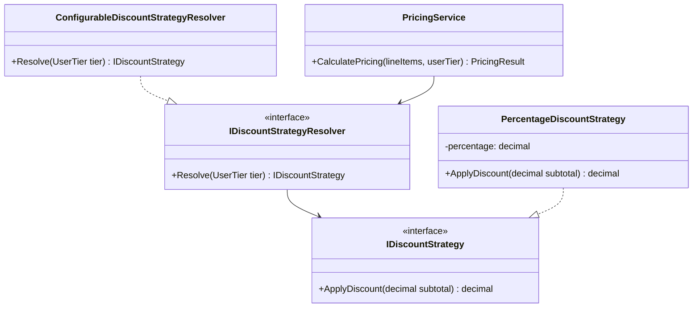
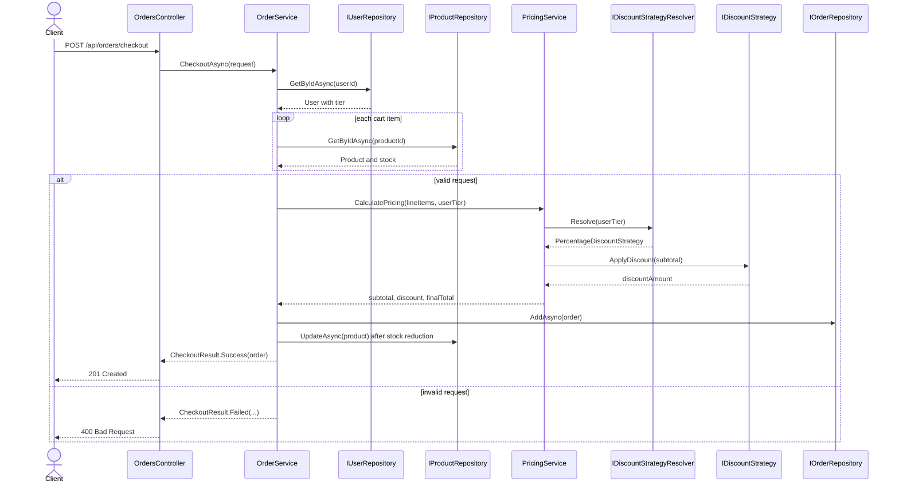

# Onion Architecture and DDD View of the Repository

This document describes how the repository is structured using an Onion/Clean Architecture style and where it aligns with Domain-Driven Design (DDD) principles.

## 1. Project-level Onion Architecture



### Dependency direction

```text
DiscountAndOrdering.Api
   -> DiscountAndOrdering.Application
   -> DiscountAndOrdering.Infrastructure

DiscountAndOrdering.Application
   -> DiscountAndOrdering.Domain

DiscountAndOrdering.Infrastructure
   -> DiscountAndOrdering.Domain
```

This is the expected onion / clean architecture structure:

```text
API -> Application -> Domain <- Infrastructure
```

The `Domain` project is the core. It holds the business model and contract interfaces, and it does not depend on the infrastructure or API layers.

---

## 2. Production structure and responsibilities

### `DiscountAndOrdering.Domain`

This is the domain core.

Entities:
- `User`
- `Product`
- `Order`
- `OrderLineItem`

Enum:
- `UserTier`

Interfaces / ports:
- `IUserRepository`
- `IProductRepository`
- `IOrderRepository`
- `IDiscountStrategy`

These interfaces define the repository and strategy contracts. The infrastructure layer implements them.

### `DiscountAndOrdering.Application`

This layer contains application services and orchestration logic.

Services:
- `UserService`
- `ProductService`
- `OrderService`
- `PricingService`

Discount logic:
- `IDiscountStrategyResolver`
- `ConfigurableDiscountStrategyResolver`
- `PercentageDiscountStrategy`
- `DiscountSettings`

DTOs:
- `UserDto`
- `ProductDto`
- `OrderResultDto`
- `CheckoutRequest`
- `CheckoutResult`

This layer depends on the Domain abstractions, not on concrete infrastructure implementations.

### `DiscountAndOrdering.Infrastructure`

This layer contains concrete implementations of the repository interfaces.

Repositories:
- `InMemoryUserRepository`
- `InMemoryProductRepository`
- `InMemoryOrderRepository`

These are in-memory adapters, which are a suitable implementation for v1. The repository pattern isolates persistence details from the business layer.

### `DiscountAndOrdering.Api`

This is the composition root and presentation layer.

Controllers:
- `UsersController`
- `ProductsController`
- `OrdersController`

`Program.cs` wires up DI and configures the startup pipeline.

---

## 3. Class and interface relationship map

```mermaid
flowchart LR
    subgraph ApiProject["DiscountAndOrdering.Api"]
        Program["Program.cs"]
        ProductsController["ProductsController"]
        UsersController["UsersController"]
        OrdersController["OrdersController"]
    end

    subgraph AppSvc["Application Services"]
        ProductService["ProductService"]
        UserService["UserService"]
        OrderService["OrderService"]
        PricingService["PricingService"]
    end

    subgraph Discounts["Discount Policy"]
        ResolverInterface["IDiscountStrategyResolver"]
        Resolver["ConfigurableDiscountStrategyResolver"]
        Strategy["PercentageDiscountStrategy"]
        Settings["DiscountSettings"]
    end

    subgraph DomainEntities["Domain Model"]
        User["User"]
        Product["Product"]
        Order["Order"]
        OrderLineItem["OrderLineItem"]
        UserTier["UserTier"]
    end

    subgraph DomainInterfaces["Domain Contracts"]
        IUserRepository["IUserRepository"]
        IProductRepository["IProductRepository"]
        IOrderRepository["IOrderRepository"]
        IDiscountStrategy["IDiscountStrategy"]
    end

    subgraph Infra["Infrastructure"]
        InMemoryUserRepository["InMemoryUserRepository"]
        InMemoryProductRepository["InMemoryProductRepository"]
        InMemoryOrderRepository["InMemoryOrderRepository"]
    end

    Program --> ProductService
    Program --> UserService
    Program --> OrderService
    Program --> PricingService
    Program --> Resolver
    Program --> InMemoryUserRepository
    Program --> InMemoryProductRepository
    Program --> InMemoryOrderRepository

    ProductsController --> ProductService
    UsersController --> UserService
    UsersController --> OrderService
    OrdersController --> OrderService

    ProductService --> IProductRepository
    UserService --> IUserRepository
    OrderService --> IUserRepository
    OrderService --> IProductRepository
    OrderService --> IOrderRepository
    OrderService --> PricingService

    PricingService --> ResolverInterface
    Resolver -. implements .-> ResolverInterface
    Resolver --> Settings
    Resolver --> Strategy
    Strategy -. implements .-> IDiscountStrategy

    User --> UserTier
    Order --> User
    Order *-- OrderLineItem
    OrderLineItem -. snapshots product data .-> Product

    InMemoryUserRepository -. implements .-> IUserRepository
    InMemoryProductRepository -. implements .-> IProductRepository
    InMemoryOrderRepository -. implements .-> IOrderRepository

    IUserRepository --> User
    IProductRepository --> Product
    IOrderRepository --> Order
```

---

## 4. DDD view

This repository has a clear DDD-inspired model, even though it is not a full enterprise DDD system.

### Aggregate roots

#### User aggregate
- `User`
- `UserTier`
- Methods like `UpdateDetails()` enforce entity invariants

#### Product aggregate
- `Product`
- Price and stock rules are validated in the entity
- `ReduceStock()` prevents negative stock

#### Order aggregate
- `Order`
- `OrderLineItem` is owned by the order
- The order contains immutable/pricing-snapshot details such as product name, unit price, subtotal, discount, and final total

This is a good DDD pattern because operational logic is concentrated in aggregate entities, and persistence is behind repository interfaces.

### Domain contracts

The repository interfaces are port definitions:
- `IUserRepository`
- `IProductRepository`
- `IOrderRepository`

The infrastructure layer adapts these to in-memory storage. This is exactly how Onion Architecture and DDD ports/adapters are usually modeled.

---

## 5. Strategy and dependency injection

### Strategy pattern

The repository uses the strategy pattern for discount logic.



The key design is that `PricingService` does not decide by `switch` statement on a user tier. Instead, it asks a resolver for the correct strategy implementation.

This makes the discount rules configurable and extensible.

### Dependency injection

The DI container wires the runtime graph in `Program.cs`:

- `IUserRepository` => `InMemoryUserRepository`
- `IProductRepository` => `InMemoryProductRepository`
- `IOrderRepository` => `InMemoryOrderRepository`
- `IDiscountStrategyResolver` => `ConfigurableDiscountStrategyResolver`
- Application services are registered as scoped services

This fits clean architecture perfectly because the application and domain layers depend only on interfaces and abstractions.

---

## 6. How the flow works in practice



This sequence clearly shows the layer boundaries:
- Controller handles HTTP request/response
- Service handles use cases
- Repository handles persistence
- Strategy handles pricing policy
- Domain entities enforce invariants

---

## 7. Strong architectural fit

This repository matches Onion Architecture very well because:

- `Domain` contains pure business concepts and rules
- `Application` contains orchestration and use cases
- `Infrastructure` contains persistence implementations
- `Api` acts as the outer adapter layer
- Dependencies point inward
- The composition root wires everything together

It also aligns with DDD at the tactical level:

- Entities: `User`, `Product`, `Order`, `OrderLineItem`
- Repository interfaces: persistence abstraction
- Aggregate ownership: `Order` owns `OrderLineItem`
- Domain rules embedded in entities
- Strategy for discount policy

---

## 8. Where it is not full DDD yet

Even though the repo is DDD-inspired, it is not a full DDD-heavy domain model. It does not yet include several common tactical DDD elements:

- Value objects (`Money`, `Email`, `Quantity`)
- Domain events
- Unit of Work
- Explicit domain services
- Bounded contexts or module decomposition
- Event-sourced flow or CQRS

For this project, the design is intentionally lightweight and pragmatic.

---

## 9. Final summary

This repo is best understood as:

- An Onion/Clean Architecture solution
- A DDD-inspired domain model with aggregate roots and repository ports
- A layered ASP.NET Core application with strong separation between domain, application, infrastructure, and API concerns

In simple terms:

```text
API layer = user interaction
Application layer = business use cases
Domain layer = core rules and entities
Infrastructure layer = persistence implementation
```

That is a strong and clean architecture for a small-to-medium enterprise C# service.

---

## 10. Architecture conclusion

If you want to show this in a single sentence:

"The repository follows Onion Architecture in project structure and DDD-inspired modeling in business entities, repository interfaces, and aggregate behavior, while keeping the implementation lightweight and practical for an in-memory, API-first discount and ordering system."
